# Setting up environments and tools

## Step 0. Begin

In order to reduce the unnecessary time waste on class, and enchance the learning experinece of student, please follow this document to setup all tool.

## Step 1. VS Code

### 1.1 Download VS Code

VS code, or Visual Studio Code is a mutiple open-source code editor developed by Microsoft.

Official website: [https://code.visualstudio.com/](https://code.visualstudio.com/)

Tutorial of VS Code: [https://www.runoob.com/w3cnote/vscode-tutorial.html](https://www.runoob.com/w3cnote/vscode-tutorial.html)
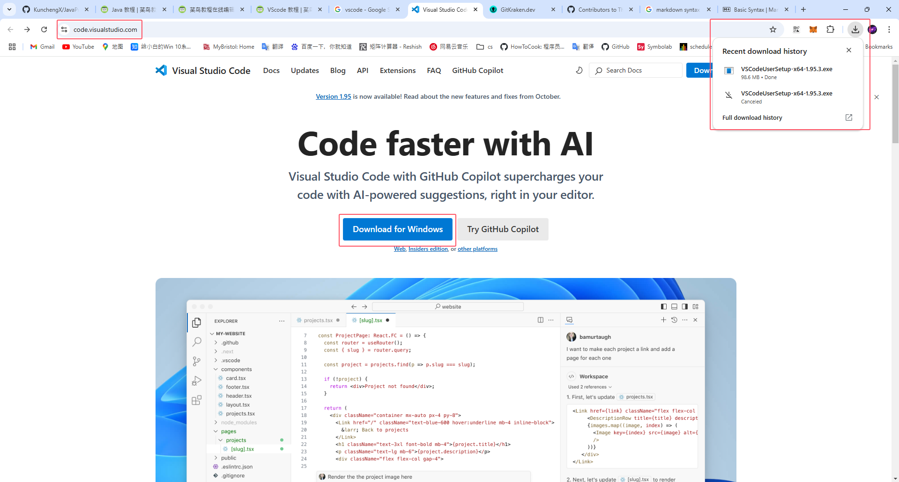

### 1.2 Download VS Code plugin

There are many usful and interesting plugins in vscode which can make your coding environment better.

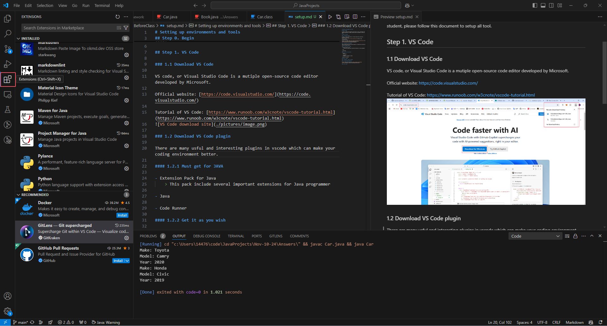

#### 1.2.1 Must get for JAVA

- Extension Pack for Java
    > This pack include several important extensions for Java programmer
    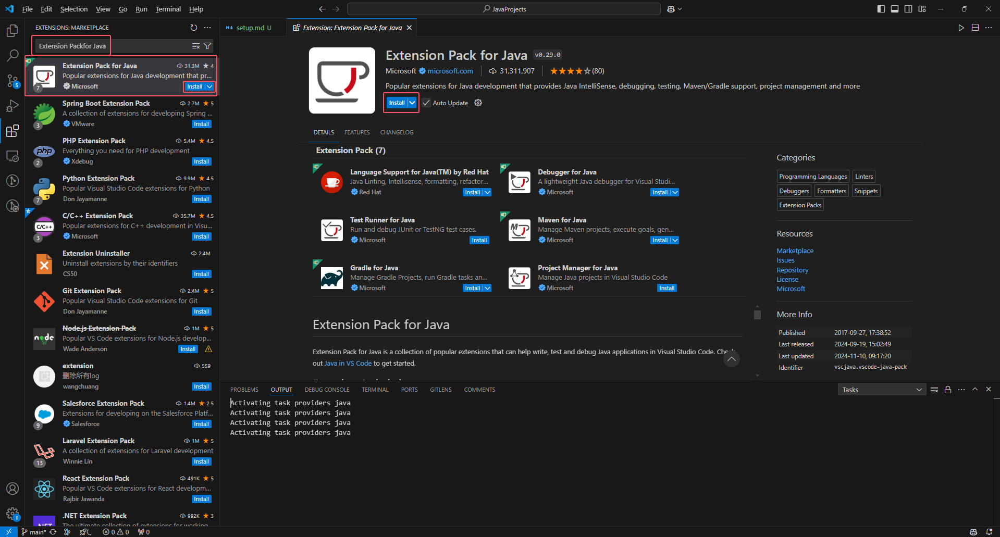

- Code Runner
    > Run code easily and elegantly without compling in terminal
    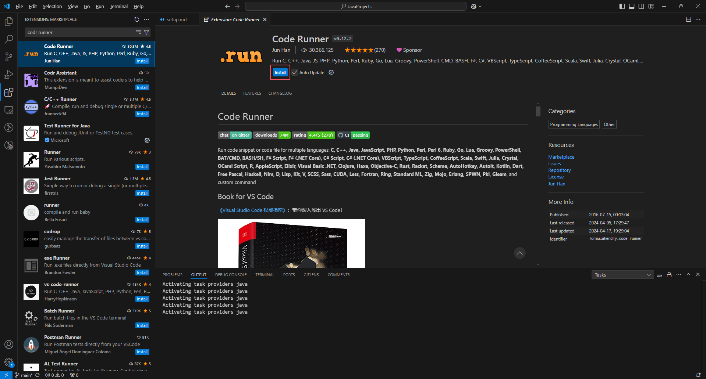

#### 1.2.2 Get it as you wish

- Chinese
    > Of course...
    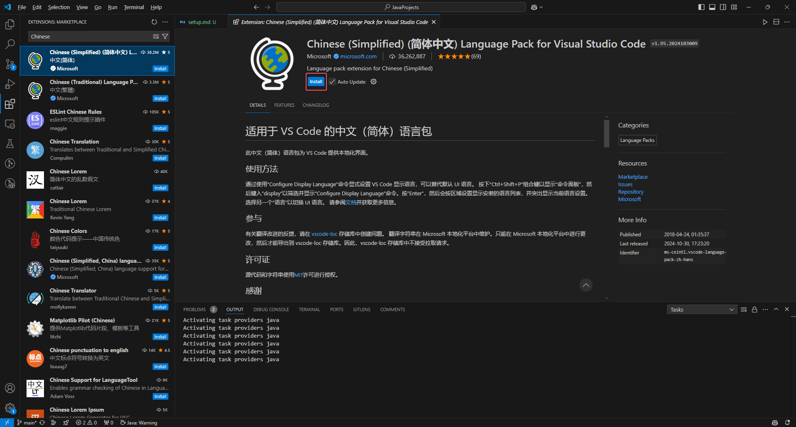

- vscode-pdf
    > Enable pdf reading in vscode
    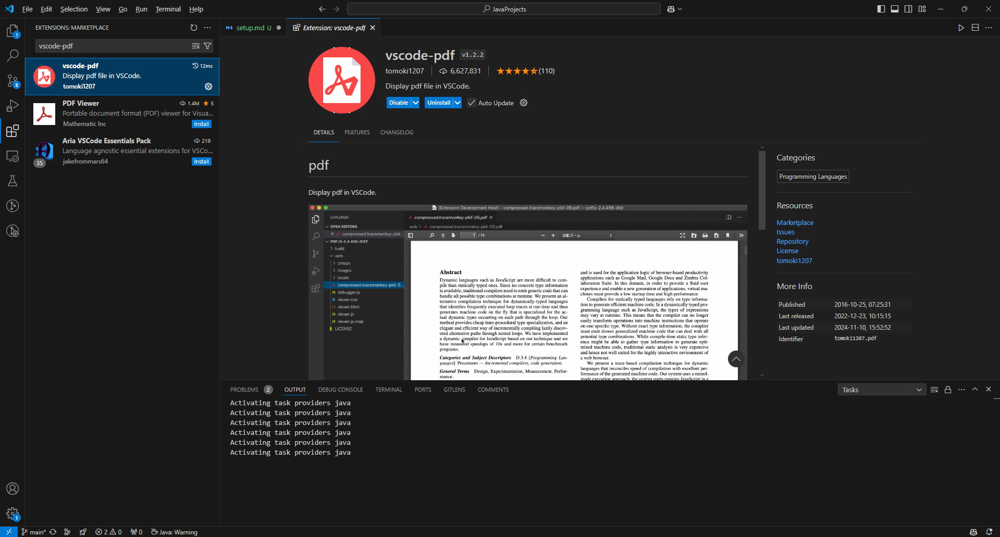

- Material Icon Theme
    > dress up your file explorer
    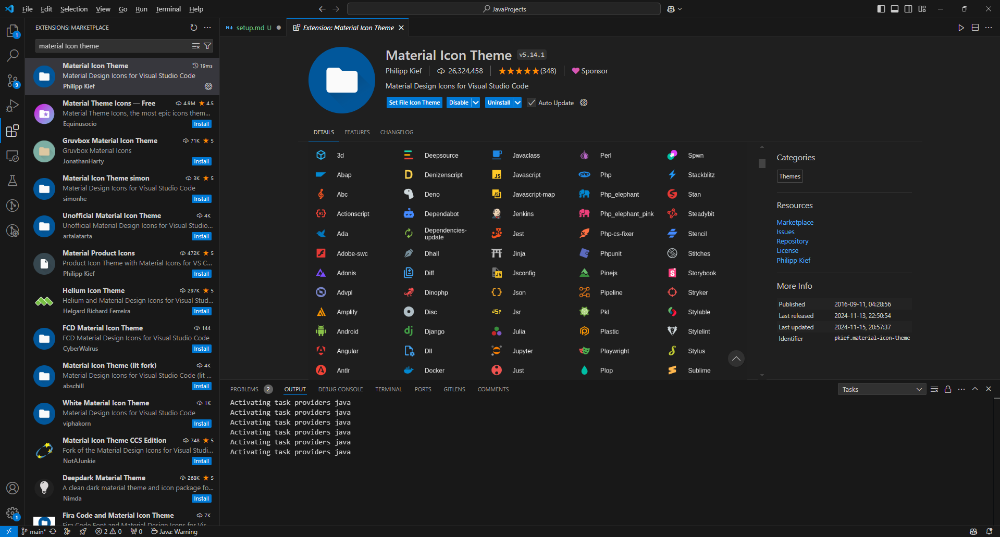

### Step 2. GitHub

### 2.1 Register / Login to GitHub

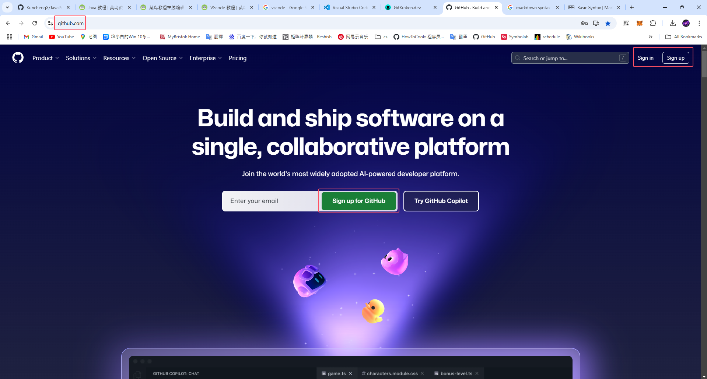

#### 2.1.1 Register

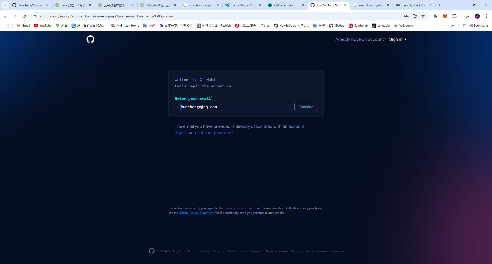

#### 2.1.2 Sign in

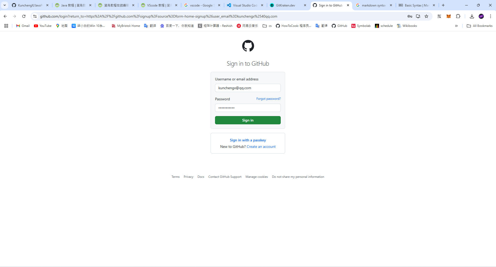

### 2.2 Class Project Respority

Project respority of this class: [https://github.com/KunchengX/JavaProjects](https://github.com/KunchengX/JavaProjects)

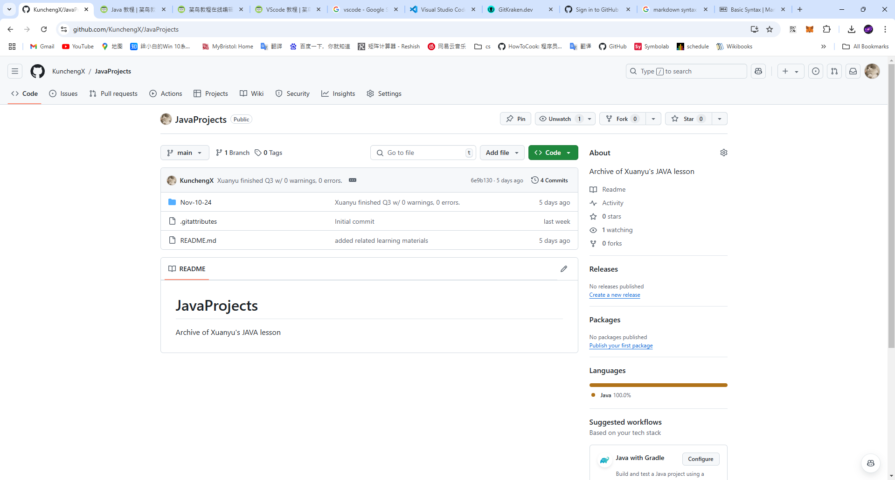

### 2.3 Download GitHub Desktop

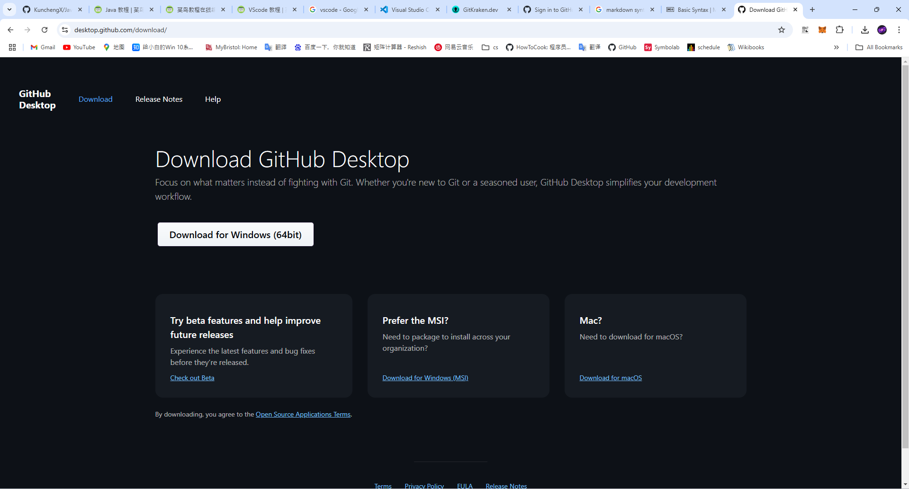

### 2.4 Contributor of Respority

Please provide your GitHub account username to teacher, then he can add you to the class project respority's contributor.

### 2.5 Git Clone

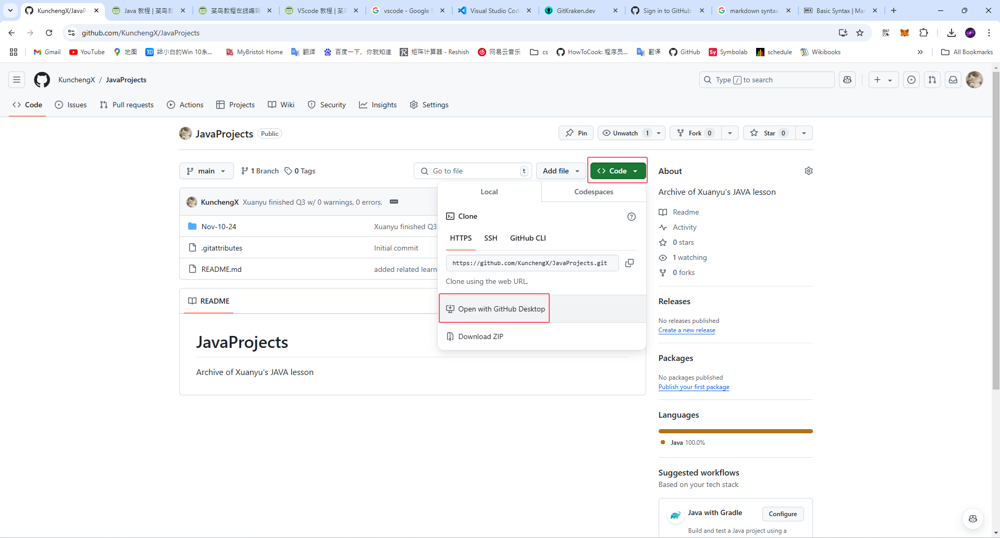

### 2.6 Git Commit
